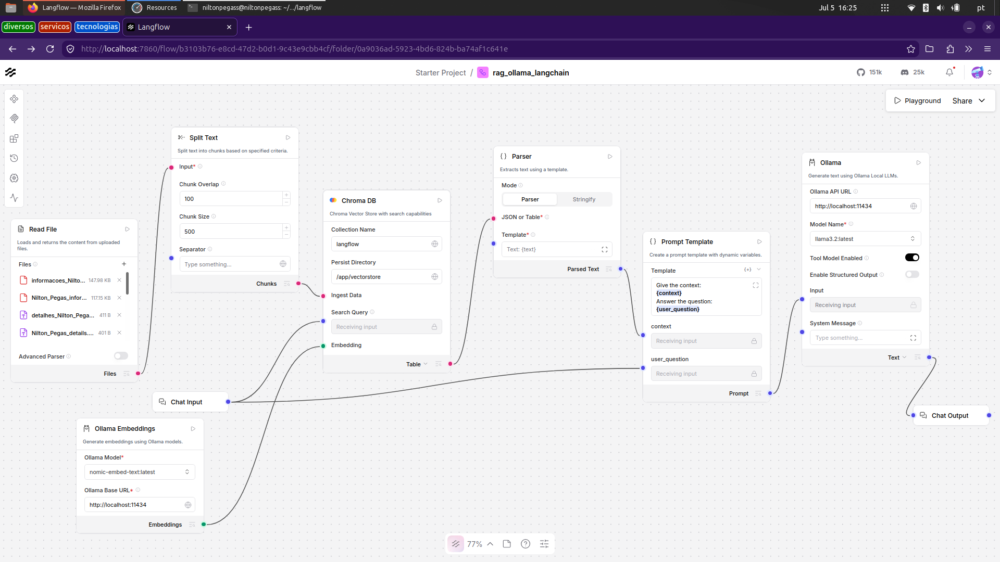
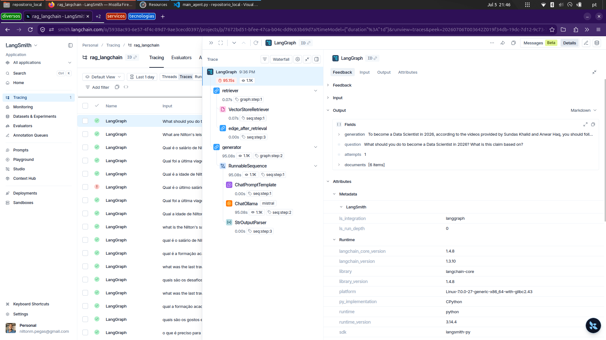

# RAG with LangChain, LangGraph, LangSmith & Langflow

A hands-on RAG (Retrieval-Augmented Generation) project built incrementally across four phases, covering the full LangChain ecosystem from a basic chain to an agentic pipeline with observability and a visual interface.

All inference runs **locally** via Ollama - no OpenAI API key or cloud costs required.

## LangFlow
<p align="center">
  <a href="https://github.com/niltonPegass/rag_ollama_langchain" target="_blank">
    
  </a>
</p>

## LangSmith
<p align="center">
  <a href="https://github.com/niltonPegass/rag_ollama_langchain" target="_blank">
    
  </a>
</p>


## Ollama (Llama3.2/Mistral) + LangChain = Terminal RAG

---

## Architecture

```
Phase 1 - Basic RAG (LangChain)
Documents > Chunking > Embeddings > ChromaDB > Retriever > Prompt > LLM > Answer

Phase 2 - Agentic RAG (LangGraph)
Question > [retriever node] > chunks found? > [generator node] > Answer
                                    └── no > retry > [fallback node] > Answer

Phase 3 - Observability (LangSmith)
Every node execution traced: latency, tokens, inputs, outputs, retrieved chunks

Phase 4 - Visual pipeline (Langflow)
Same pipeline reproduced via drag-and-drop interface
```

---

## Stack

| Layer | Tool |
|---|---|
| Framework | LangChain |
| Agent orchestration | LangGraph |
| Vector store | ChromaDB (local) |
| Embeddings | nomic-embed-text (via Ollama) |
| LLM | mistral / llama3.2 (via Ollama) |
| Observability | LangSmith |
| Visual interface | Langflow (via Docker) |

---

## Project structure

```
rag-langchain/
├── docs/
│   ├── personal/           ← documents with personal/profile data
│   └── youtube/            ← summaries of YouTube video examples
├── images/                 ← project screenshots and demo videos
├── notes/                  ← learning guides and project documentation
├── flows/
│   └── rag_ollama_langchain.json  ← exported Langflow pipeline
├── langflow_data/          ← Langflow database (flows, settings)
├── vectorstore/            ← ChromaDB persisted embeddings (auto-created)
├── logs/                   ← structured log files (auto-created)
├── src/
│   ├── __init__.py         ← makes src/ a Python package
│   ├── config.py           ← all settings in one place (models, paths, thresholds)
│   ├── logger.py           ← structured logging to console and file
│   ├── loader.py           ← document loading and chunking
│   ├── vectorstore.py      ← ChromaDB build and load logic
│   ├── retriever.py        ← retriever factory (search strategy)
│   ├── prompts.py          ← all prompt templates centralized
│   ├── chain.py            ← Phase 1: LCEL RAG chain
│   └── agent.py            ← Phase 2: LangGraph nodes and graph assembly
├── tests/
│   ├── test_loader.py      ← tests for document loading and chunking
│   ├── test_prompts.py     ← tests for prompt template rendering
│   └── test_agent.py       ← tests for agent routing logic
├── main_chain.py           ← entry point — Phase 1 (basic RAG chain)
├── main_agent.py           ← entry point — Phase 2 (agentic RAG with LangGraph)
├── diagnostics.py          ← vector store inspection utilities
├── pytest.ini              ← test configuration
├── requirements.txt
├── .env                    ← API keys
└── .gitignore
```

---

## Setup

### Prerequisites

- Python 3.11+
- [Ollama](https://ollama.com) installed and running
- Docker (for Langflow)

### 1. Clone and create environment

```bash
git clone https://github.com/niltonPegass/rag-langchain.git
cd rag-langchain
python3.11 -m venv .venv
source .venv/bin/activate
pip install -r requirements.txt
```

### 2. Pull Ollama models

```bash
ollama pull mistral
ollama pull nomic-embed-text
```

### 3. Configure LangSmith (Phase 3)

Create a `.env` file:

```env
LANGCHAIN_TRACING_V2=true
LANGCHAIN_ENDPOINT=https://api.smith.langchain.com
LANGCHAIN_API_KEY=your_key_here
LANGCHAIN_PROJECT=rag-langchain
```

### 4. Add documents

Place your `.pdf` or `.txt` files in the `docs/` folder.

---

## Usage

### Phase 1 - Basic chain

```bash
python rag_chain.py
```

Indexes documents on first run, loads from disk on subsequent runs.

### Phase 2 - Agentic RAG

```bash
python rag_agent.py
```

Prompts for model choice (`llama3.2` or `mistral`), then starts the agent loop.

### Diagnostics

```bash
python diagnostics.py
```

Options:
- Semantic search - inspect chunk retrieval scores
- Lexical search - verify if a term exists in the vector store
- List sources - confirm which documents were indexed

### Phase 4 - Langflow (visual pipeline)

```bash
# expose Ollama to Docker
sudo mkdir -p /etc/systemd/system/ollama.service.d/
# see ollama_docker_langflow_setup.md for full instructions

# run Langflow
docker run -it -p 7860:7860 \
  -v $(pwd)/vectorstore:/app/vectorstore \
  -v $(pwd)/langflow_data:/app/langflow \
  -e LANGFLOW_DATABASE_URL=sqlite:////app/langflow/langflow.db \
  langflowai/langflow:latest
```

Import `flows/rag_ollama_langchain.json` in the Langflow UI.

---

## Key concepts

**RAG (Retrieval-Augmented Generation)** - instead of relying on the LLM's training data, relevant document chunks are retrieved at query time and injected into the prompt as context. This grounds the answer in your documents and reduces hallucination.

**Embeddings** - dense vector representations of text. Semantically similar texts produce similar vectors, enabling semantic search beyond keyword matching.

**ChromaDB** - local vector database that stores embeddings and supports similarity search. Persists to disk so indexing only happens once.

**LangGraph** - extends LangChain with stateful graph execution. Nodes are functions, edges define flow, conditional edges enable branching and retry loops.

**LangSmith** - observability platform for LLM applications. Traces each node execution with latency, token counts, and full input/output - equivalent to MLflow for LLM pipelines.

**Langflow** - visual low-code interface that represents LangChain pipelines as drag-and-drop graphs. Useful for prototyping and communicating pipeline architecture.

---

## Observability

With LangSmith configured, each agent run is traced at [smith.langchain.com](https://smith.langchain.com):

- Per-node latency and token usage
- Full input/output for each node
- Retrieved chunks and their sources
- Retry paths through the graph

---

## Notes

- The `vectorstore/` directory is gitignored - re-index by running `rag_chain.py` or `rag_agent.py` with an empty vectorstore folder
- Langflow flows are exported as JSON in `flows/` for version control
- For the Langflow + Docker + Ollama setup, see `docs/ollama_docker_langflow_setup.md`
